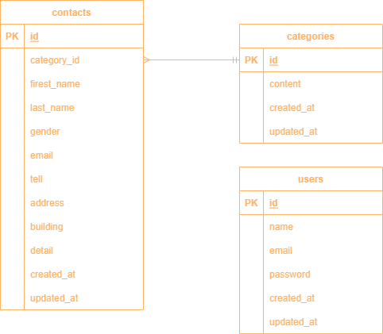

# 確認テスト用アプリケーション

## 環境構築

### ディレクトリ構成

```
AbilityTest
├── docker
│   ├── mysql
│   │   ├── data
│   │   └── my.cnf
│   ├── nginx
│   │   └── default.conf
│   └── php
│       ├── Dockerfile
│       └── php.ini
├── docker-compose.yml
└── src
```

#### docker-compose.yml

```
version: '3.8'

services:
  nginx:
    image: nginx:1.21.1
    ports:
      - "80:80"
    volumes:
      - ./docker/nginx/default.conf:/etc/nginx/conf.d/default.conf
      - ./src:/var/www/
    depends_on:
      - php

  php:
    build: ./docker/php
    volumes:
      - ./src:/var/www/

  mysql:
    image: mysql:8.0.26
    environment:
      MYSQL_ROOT_PASSWORD: root
      MYSQL_DATABASE: laravel_db
      MYSQL_USER: laravel_user
      MYSQL_PASSWORD: laravel_pass
    command:
      mysqld --default-authentication-plugin=mysql_native_password
    volumes:
      - ./docker/mysql/data:/var/lib/mysql
      - ./docker/mysql/my.cnf:/etc/mysql/conf.d/my.cnf

  phpmyadmin:
    image: phpmyadmin/phpmyadmin
    environment:
      - PMA_ARBITRARY=1
      - PMA_HOST=mysql
      - PMA_USER=laravel_user
      - PMA_PASSWORD=laravel_pass
    depends_on:
      - mysql
    ports:
      - 8080:80
```

#### docker/mysql/my.cnf

```
[mysqld]
character-set-server = utf8mb4

collation-server = utf8mb4_unicode_ci

default-time-zone = 'Asia/Tokyo'
```

#### docker/nginx/default.conf

```
server {
    listen 80;
    index index.php index.html;
    server_name localhost;

    root /var/www/public;

    location / {
        try_files $uri $uri/ /index.php$is_args$args;
    }

    location ~ \.php$ {
        fastcgi_split_path_info ^(.+\.php)(/.+)$;
        fastcgi_pass php:9000;
        fastcgi_index index.php;
        include fastcgi_params;
        fastcgi_param SCRIPT_FILENAME $document_root$fastcgi_script_name;
        fastcgi_param PATH_INFO $fastcgi_path_info;
    }
}
```

#### docker/php/Dockerfile

```
FROM php:7.4.9-fpm

COPY php.ini /usr/local/etc/php/

RUN apt update \
  && apt install -y default-mysql-client zlib1g-dev libzip-dev unzip \
  && docker-php-ext-install pdo_mysql zip

RUN curl -sS https://getcomposer.org/installer | php \
  && mv composer.phar /usr/local/bin/composer \
  && composer self-update

WORKDIR /var/www
```

#### docker/php/php.ini

```
date.timezone = "Asia/Tokyo"

[mbstring]
mbstring.internal_encoding = "UTF-8"
mbstring.language = "Japanese"
```

### Docker ビルド

`docker-compose up -d --build`

### Laravel インストール

`composer create-project "laravel/laravel=8.*" . --prefer-dist`

### timezone の設定

#### src/config/app.php

```
- 'timezone' => 'UTC',
+ 'timezone' => 'Asia/Tokyo',
```

### .env ファイルの設定

#### src/.env

```
DB_CONNECTION=mysql
- DB_HOST=127.0.0.1
+ DB_HOST=mysql
DB_PORT=3306
- DB_DATABASE=laravel
- DB_USERNAME=root
- DB_PASSWORD=
+ DB_DATABASE=laravel_db
+ DB_USERNAME=laravel_user
+ DB_PASSWORD=laravel_pass
```

### マイグレーション

```
php artisan make:migration create_contacts_table
php artisan make:migration create_categories_table
```

users テーブルはデフォルトで存在しているため、作成しない。

```
php artisan migrate
```

### シーディング

## 使用技術(実行環境)

- PHP 7.4.9
- Laravel 8.6.12
- MySQL 8.0.26
- nginx 1.21.1

## ER 図



## URL

- 開発環境：http://localhost/
- phpMyAdmin：http://localhost:8080/
